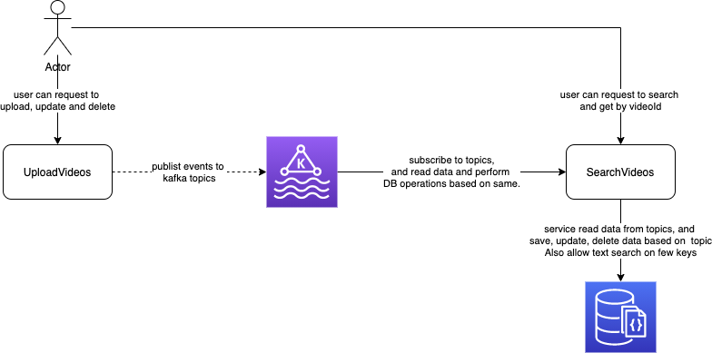

# VidShare
VidShare is online video sharing platform.

---

## TOC
1. [Key Feature List](#key-feature-list)
2. [Upload Video Service](#upload-video-service)
3. [Search Video Service](#search-video-service)
4. [Development](#development)
4. [Future work](#Future-work)

---
## Key Feature List 
Following are the two features developed in scope for this microservcie. For full details [click here](readme_full_context.md)
1. Uplaod Video Service
2. Search Video Service



## Upload Video Service
Upload video service have following apis exposed
### **Post | api/v1/video/upload**
to upload file and metadata like title, description, tags etc.
````
curl request : 
curl --location --request POST 'http://localhost:3000/api/v1/video/upload' \
--form 'videoId="video003"' \
--form 'userId="user0002"' \
--form 'channelName="mychannel three"' \
--form 'title="my video title three"' \
--form 'descriptions="this is description1"' \
--form 'tags="hello,video,world,1"' \
--form 'videoLanguage="en"' \
--form 'isPrivate="false"' \
--form 'file=@"/Users/brikumar2/Desktop/PDF-POC-Files/Thai Document-AA.jpg"'
````
The service further push data to following kafka topics, message key is a random number
#### **vidshare-videoupload-media**
this topic will have message value as following
````
{"file":"../uploads/f33fe757751593cb1aef345b55b43b98","videoId":"video003"}
````
#### **vidshare-videoupload-metadata**
this topic will have message value as following
````
{"userId":"user0002","videoId":"video003","channelName":"mychannel three","title":"my video title three","descriptions":"this is description1","tags":"hello,video,world,1","videoLanguage":"en","isPrivate":"false","createdTime":"2022-05-08T12:40:17.764Z","lastModifiedTime":"2022-05-08T12:40:17.764Z"}
````

### **Patch | api/v1/video/upload/{videoId}**
to update file and metadata like title, description, tags etc.
````
curl request:
curl --location --request PATCH 'http://localhost:3000/api/v1/video/upload/video002' \
--form 'userId="user0001"' \
--form 'channelName="mychannel is good update"' \
--form 'title="my video title three"' \
--form 'descriptions="this is description updated"' \
--form 'tags="hello,video,world"' \
--form 'videoLanguage="en"'
````
The service further push data to following kafka topics, message key is a random number
#### **vidshare-videoupload-metadata-update**
this topic will have message value as following
````
{"userId":"user0001","videoId":"video002","channelName":"mychannel is good update","title":"my video title three","descriptions":"this is description updated","tags":"hello,video,world","videoLanguage":"en","lastModifiedTime":"2022-05-08T12:42:02.390Z"}
````

### **Delete | api/v1/video/upload/{videoId}**
to delete the data.
````
curl request:
curl --location --request DELETE 'http://localhost:3000/api/v1/video/upload/video001' \
--form 'vidoeId="video_001"'
````
The service further push data to following kafka topics, message key is a random number
#### **vidshare-videoupload-metadata-update**
this topic will have message value as following
````
video001
````
Swagger link : http://localhost:3000/api-docs

---
## Search Video Service
Search video service reads data from the kafka topics, and save them to MongoDB.
- MongoDb have following indexes created 
    - VideoId :1, unique:true
    - title: text, tags: text, description: text

have following apis exposed.

### **GET | api/v1/search?text=vidoe**
to search the data from existing uploaded files
````
curl --location --request GET 'http://localhost:3001/api/v1/search?text=video'
````
### **GET | api/v1/search/{videoId}** - to upload file and metadata like title, description, tags etc.
````
curl --location --request GET 'http://localhost:3001/api/v1/search/video003'
````
Swagger link : http://localhost:3001/api-docs

---
## Development
The services are dockarize and can run in environment supporting docker. Currently Docker-desktop environment is used to the development purpose. To run the app in local machine, ensure docker-desktop is running properly. Then follow the steps mentioned below.
1. Checkout this repository in local machine.
2. Run command `docker-compose up --build -d` 

    - Running this will create and run zookeeper, kafka, mongo, mongo-express, uploadvideo and searchvideo app instances
    - uploadvideo app will run on port 3000
    - searchvideo app will run on port 3001
    - api-documentation(swagger) is avilable on path /api-docs for respective apps.
    - MongoDb data can access via mongo-express on http://localhost:8081/
3. To shutdown the applications run `docker-compose down`

### To run unit tests and check coverage
Follwo the following steps.
1. Checkout this repository.
2. In terminal open this folder
3. To run test in uploadvideo service
    - In termial enter the uploadvideos dir `cd uploadvideos`
    - Install node modules using npm `npm install`
    - run unit tests `npm test`
    - to check coverage in browser, open following file
    `uploadvideos/coverage/my_reports/index.html`
    - to check unit test status in browser, open following file
    `uploadvideos/jest-stare/index.html`
4. To run test in uploadvideo service
    - In termial enter the uploadvideos dir `cd searchvideos`
    - Install node modules using npm `npm install`
    - run unit tests `npm test`
    - to check coverage in browser, open following file
    `searchvideos/coverage/my_reports/index.html`
    - to check unit test status in browser, open following file
    `searchvideos/jest-stare/index.html`

---
## Future Work
1. Implementing correlation id for request tracking purpose.
2. Kafka authorization and role based access implementation.
3. MongoDB user authorization support implementation.
4. Elegent error handling in server.
6. User authorization, role base access implementation.
7. Validation on data in the services implemented.
8. File validation for video file only support.
