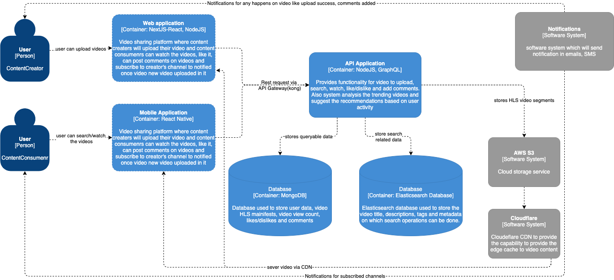
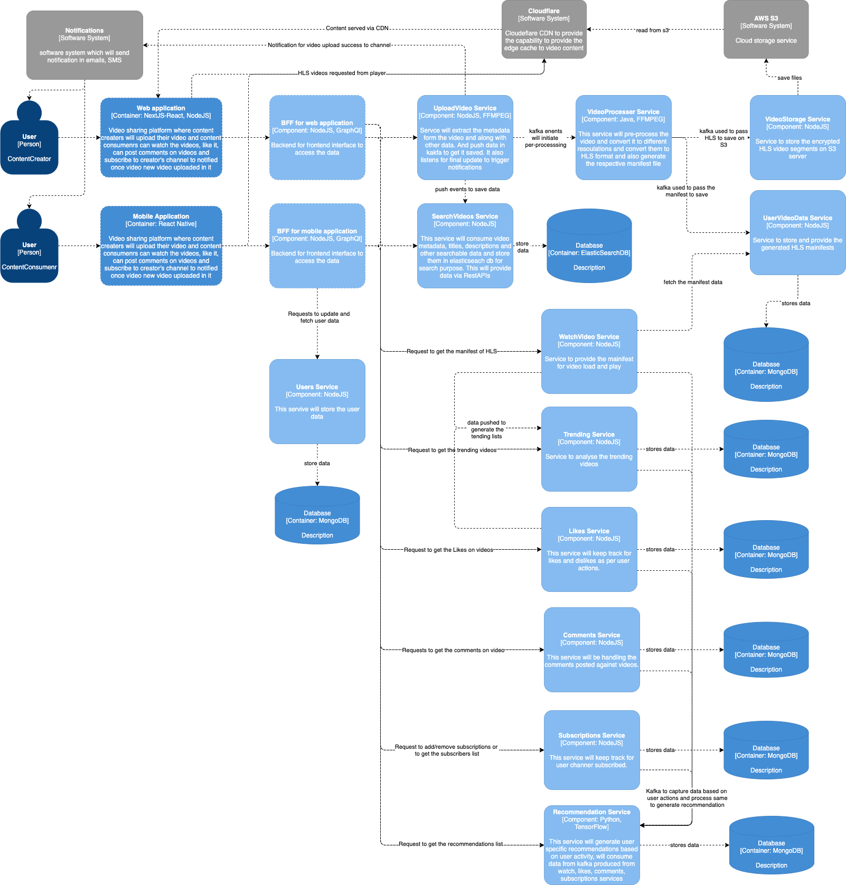

# VidShare
VidShare is online video sharing platform.

### Feature List
1. Login
2. Video Upload
3. Video Search
4. Video Browse
5. Video Subscriptions

### Assumptions
* Browsing video list and view of will not require any login.
* User can upload, subscribe, like or comment only after login.
* One user can have only one channel, and all videos uploaded by them will be part of that channel. 
* By default, all videos will be public, user must make them private to prevent it to view from other users.
* Search will be based on title, description, tags and video metadata only for this MVP in primary filters, Secondary filters may have upload date, like or comment count range or duration are not considered.
* Auto tagging based on video content is not considered. A recommendation system will be there but details of same are not defined.
* User will be able to share videos via short links or embedded code only.
* Live feeds, chat systems are not considered.

### Architecture styles

The architecture style considered event driven microservices based system with BFF layer to communicate with frontend web/mobile applications which enables us to have 
* Loose coupling between components
* Independent individual components
* Asynchronous nature, help in elastic scalability of workflows
* Better at fault tolerance and resiliency
With these features system should be able to produce and consume large amount of data without breaking and can be easily extended as and when needed.

### Architecture characteristics
* Availability
* Scalability
* Performance
* Reliability
* Security

### Architecture Design Principles
* System will be accessed via HTTPs only.
* Micro-services should not directly interact with another service, it should be done via async messaging like kafka, where-ever possible. 
* All service should maintain their own data and rules for handling the same.
* All services should be transportable
* All service containers will have health checks and monitoring enabled and should provide logs to aggregators like kibana and Grafana. Monitoring tools should generate real-time alters in case of health check(cup use, memory use, services errors etc.) surpasses the configured the threshold.
* CoreleationsIDs should be added via API Gateway, should be logged and save in audits for each services for backtracking purpose in case of debugging required.

### Architecture decisions

* User authorization and authentication will be done at API gateway to prevent any unauthorized access in the system.
* All client systems will connect services via BFF layer, BFF will implement graphql to prevent any unnecessary data exposure to client.
* Extra user data will be captured in progressive manner when needed, and will be updated via restAPIs
* Video upload feature will be async and use pub-sub with to pre-process the video, extract metadata from it.
* Video metadata, title, descriptions, tags will be stored elastic search for better text bases searching capability.
* Videos will be converted in HLS format and stored on S3 as encrypted and a CDN will be in front to access the video files.
* Manifest for HLS will be stored in MongoDB
* Like/dislike and comments posting will be done via restAPIs from client using  and MS will further use sagas and via choreography handles the update of system for eventual consistency
* Recommendation service will be accessed via restAPIs, but it will pre-generate the recommendations based on user activity(TBD).
* Generation of recommendations will be done in async Kafka on event generated based on user activity.
* Share feature will be bases on restAPIs and will use 3rd party solution to provide short URLs.
* Embedded Video share will generate the code snippet to be used in HTML.

### C4 Diagrams

Context Diagram

Component Diagram

Container Diagram
